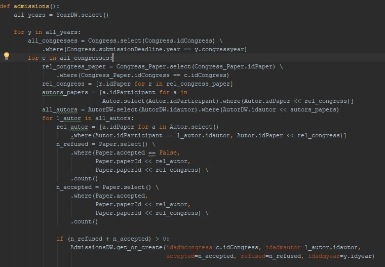

Title: Aplicação ETL - Extração, Transformação e Carga
Date: 2017-11-01 22:35
Category: DataWarehouse
Tags: etl, starSchema, DataWarehouse
Slug: aplicacao-etl
Author: Felipe Andrade
Summary: Migrando dados de uma base relacional para Star Schema

# Migrando dados de uma base relacional para Star Schema

Na etapa anterior foi feito a modelagem do Star Schema onde se utilizou dados ficticios para testar.
Após ter definido como seria a base DW, chegou a hora de migrar as informações do modelo relacional para essa nova base.

O modelo relacional está da seguinte forma:

 
***Figura 1.** Diagrama Entidade Relacionamento do modelo relacional.*

Sendo que a base DW está no formato abaixo:

 
***Figura 2.** Diagrama Entidade Relacionamento do modelo Star Schema.*

A carga do modelo star schema com os dados relacional será atráves de uma aplicação ETL(Extract, Transform, Load).
Essa aplicação irá ler os dados, realizar a normalização e inserir no banco DW.
Para criação dessa aplicação foi utilizado a linguagem de programação Python com a biblioteca [Peewee](http://docs.peewee-orm.com/).

Para cada tabela destino foi criado um metodo para fazer a migração, as tabelas autor, year e congress, foram mais simples por não depender de muitas relações.

 
***Figura 3.** Métodos para carga de autor, year e congress.*

Já a tabela Admissions, é o compilado de dados das tabelas Congress, Congress_paper, Paper, Autor e Year, o que elevou sua complexidade em relação as outras tabelas.

 
***Figura 4.** Método para carga de Admissions.*

Para administrar todos esses métodos, foi criado uma classe main em que todos eles passavam por um controle de transação.

 
***Figura 5.** Main com Commit e Rollback para controle das transações.*

