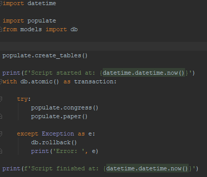
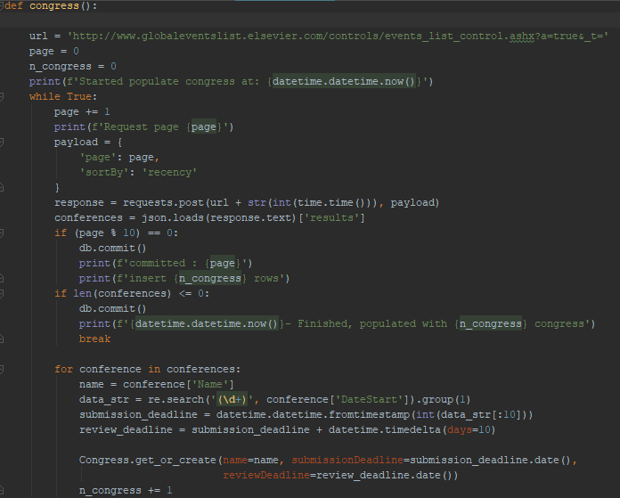
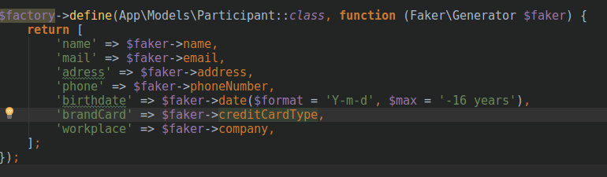
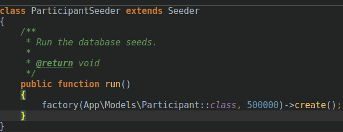
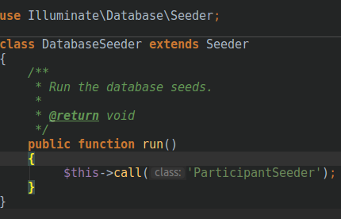

Title: Aplicação OLTP para Controle de Submissão e Avaliação de Artigos
Date: 2017-08-30 7:30
Category: oltp
Tags: oltp, laravek
Authors: Elizabete Reis, Felipe Andrade, Társis Lima
Summary: = Aplicação OLTP para Controle de Submissão e Avaliação de Artigos

# Aplicação OLTP para Controle de Submissão e Avaliação de Artigos 

A aplicação OLTP para o sistema de submissão, já descrito no post anterior, que será apresentada nos parágrafos seguintes foi construída com apoio das framework *Laravel, Docker e Bootstrap*. A elaboração do sistema seguiu as etapas ilustradas na figura 1.

Figura 1. Etapas para elaboração da aplicação

As primeiras etapas foram as de coleta de requisitos e modelagem, já descrita no post anterior, após seguiu-se para a população da base, criação das transações de *commit* e *rollback* e finalização da aplicação.

A geração de dados para povoar o banco foi feita dividida em 3 etapas:
A primeira etapa foi povoar as tabelas *Congress* e *Paper*, para isso foi utilizado uma técnica chamada *Web Scrapping*, na qual é criado um programa que varre a web coletando dados específicos (o código utilizado se encontra em https://github.com/Felipeandradee/scrapper-tebd ). A figura 2 e 3 ilustram um trecho do script que realiza primeira etapa do povoamento.

Figura 2. Primeira Etapa do Povoamento

Figura 3. Primeira Etapa do Povoamento.

A segunda etapa foi povoar a tabela Participant, nesse caso foi utilizado uma biblioteca php chamada *Faker* que gera dados fictícios aleatório com base em um padrão pré definido.
Por fim, com esses dados foi possível criar as tabelas reviser, autor, congress_paper e review, já que são tabelas que fazem a junção de dados das etapas 1 e 2. As figuras 4 e 5 ilustram a segunda etapa do povoamento.

Figura 4. Definição das regras para geração dos dados para cada campo da tabela Participants.

Figura 5. Chamada ao gerador solicitando a criação de 500.000 registros fictícios.

Por fim adicionamos uma chamada ao seed criado na classe DatabaseSeed que é responsável por executar os seeds (Figura 6).

Figura 6. Chamada ao seed.

O programa foi executado via terminal com o comando: 	“php artisan migrate --seed”.