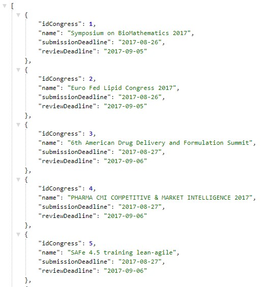
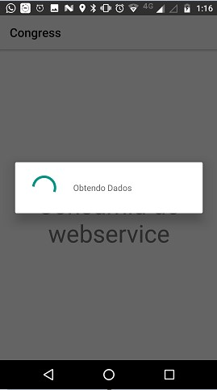
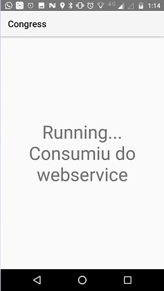
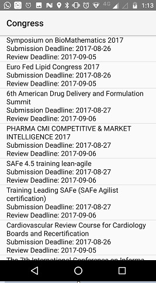
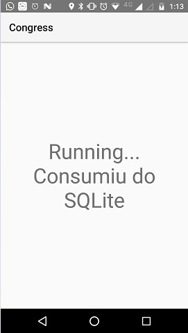
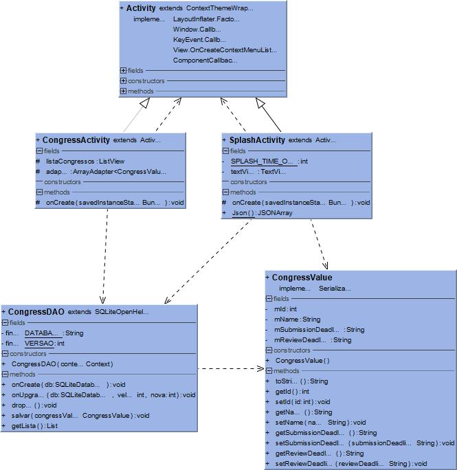

Title: Aplicativo Android para listagem de congressos
Date: 2017-09-27 07:30
Category: oltp
Tags: android, mobile, json
Slug: aplicativo-android-congress
Author: Felipe Andrade
Summary: Descricação do Aplicativo Android Congress

# Aplicativo Android para listagem de congressos

----------

Utilizando dos conhecimentos adquiridos através do nivelamento com o aplicativo Faculdade,
foi criado um app para listagem de congressos.

Os dados dos congressos a serem listados estavam disponiveis em um json que poderia ser acessado através de uma
requisição ao servidor.

Figura 1. Parte do Json disponivel.

Quando o aplicativo era aberto pela primeira vez, ele fazia uma requisição do tipo GET à rota que se encontrava o json.
Com os dados carregando então salvada tudo em um banco sqlite no smartphone.

Figura 2. Splash quando é carregado o json.

Figura 3. Splash com mensagem quando o dados é consumido do servidor.

Após os dados serem carregados e salvos no sqlite do smartphone, é então exibido a listagem dos congressos com nome,
dada limite de submissão e data limite de revisão.

Figura 4. ListView preenchida com os congressos

Nos próximos acessos ao aplicativo, o mesmo não irá consultar o servico web, pois os dados já estão salvos no smartphone,
permitindo assim um acesso sem necessidade de conexão com a internet. Sendo exibido uma mensagem no splash
informando que foi consumido diretamento do SQLite.

Figura 5. Splash com mensagem quando o dados é consumido do SQLite.

A arquitetura utilizada no desenvolvimento do aplicativo pode ser vista no diagrama de classe da figura 6.

Figura 6. Diagrama de classes do app
