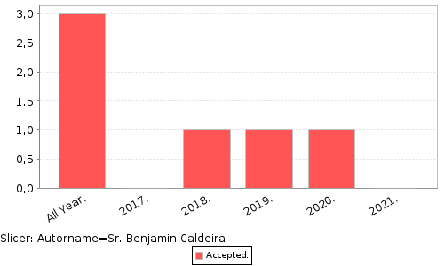
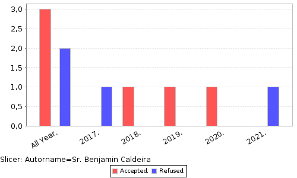
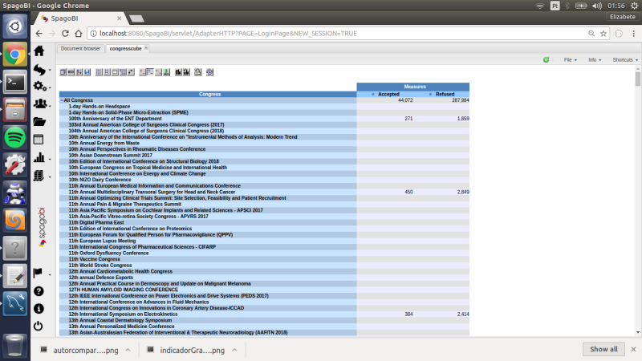
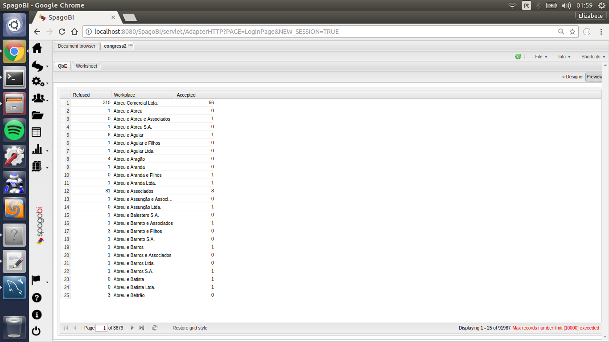

Title: Aplicação OLAP - Coletando informações de indicadores
Date: 2017-11-06 07:35
Category: DataWarehouse
Tags: etl, starSchema, indicador
Slug: indicador
Author: Elizabete Reis
Summary: Coletando informações de indicadores

#Aplicação OLAP - Coletando informações de indicadores

Após finalizada as etapas de [modelagem do star schema da aplicação](https://felipeandradee.github.io/blog-tebd-uneb2017/projeto-dw.html) e [migração dos dados](https://felipeandradee.github.io/blog-tebd-uneb2017/aplicacao-etl.html) do banco relacional para o datawarehouse através do processo de ETL, agora é possível tirar conclusões sobre o andamento do negócio através dos indicadores escolhido. O indicador em questão, já explicado no [post](https://felipeandradee.github.io/blog-tebd-uneb2017/projeto-dw.html) anterior, foi o número de artigos publicados por autor. A figura 1 ilustra o número de artigos publicados pelo autor de nome "*Sr. Benjamin Caldeira*" entre os anos de 2017-2021. A query usada no editor MDX para gerar o gráfico foi:

    select {[Measures].[Accepted]} ON COLUMNS,
     {[Year]} ON ROWS
     from [Admissions]
     where ([Autor].[Sr. Benjamin Caldeira])

O indicador exemplicado pode ser usado, por exemplo, para avaliar a produção acadêmica de pesquisadores ao longo do tempo, a figura 2 mostra a comparação entre artigos recusados e aceitos. 

O gráfico ilustrado foi obtido através da interface do SpagoBI para o cubo olap, a figura 3 ilustra a tela inicial da interface citada.

A figura 3 dá uma visão geral de congressos e o total de artigos recusados e aceitos. Também é possível visualizar informações e gerar gráficos através da interface do Qbe (figura 4).

Na figura acima é possível visualizar os artigos aceitos e recusados agrupados por local de trabalho. É possivel alterar o estilo do gráfico via interface e o conteúdo das colunas através do editor MDX que é bastante simplicado e permite a elaboração de queries rapidamente.
