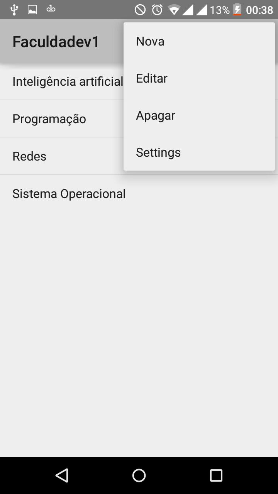

Title: Instalando ambiente e rodando aplicativo Faculdade
Date: 2017-09-26 07:30
Category: oltp
Tags: android, faculdadeapp, json
Slug: projeto-modelo
Author: Elizabete Reis
Summary: rodando aplicativo Faculdade

**Instalando ambiente e rodando aplicativo Faculdade**

----------
Inicialmente foi necessário instalar os softwares:

 1. [Android Studio IDE](https://www.google.com.br/url?sa=t&rct=j&q=&esrc=s&source=web&cd=1&cad=rja&uact=8&ved=0ahUKEwjVqYe9sr_WAhXFQ5AKHWMYDwsQFggnMAA&url=https://developer.android.com/studio/index.html?hl=pt-br&usg=AFQjCNF8PxvEsM6EHrskydLGaLtNCh8L6A)
 2. [GenyMotion](https://www.google.com.br/url?sa=t&rct=j&q=&esrc=s&source=web&cd=1&cad=rja&uact=8&ved=0ahUKEwj42MbKsr_WAhWHk5AKHboiBwQQFggnMAA&url=https://www.genymotion.com/&usg=AFQjCNFe_83y8u2kkTCsdtEigYhL4Wskrw)

Para o android studio a instalação foi descomplicada no Ubuntu 16.10 sendo necessário apenas rodar um script que faz a instalação de todo ambiente. O genymotion foi instalado como plugin pela ide, no entanto não está sendo utilizado. 

Após concluída a instalação do ambiente, o projeto foi importado e todas as depedências necesssárias instaladas, o que demandou um tempo considerável. 

Na figura 1 pode ser vista a tela de *splash* do aplicativo *Faculdade*, durante o carregamento, o app consome o [JSON](http://www.ictios.com.br/emjorge/appfaculdade/index1.php) que fornece um lista de disciplinas que será posteriormente salvo no banco.

Figura 1. Tela de Splash 

Outras ações também tais como criar nova disciplina, editar e apagar.  podem ser realizadas através do menu na tela principal ilustrado na figura 2.

Figura 2. Tela principal e Menu
