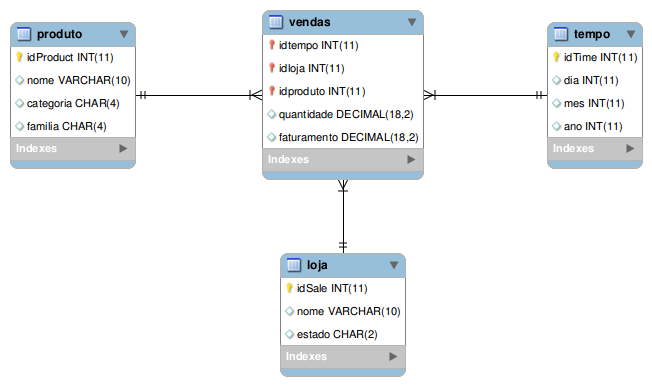
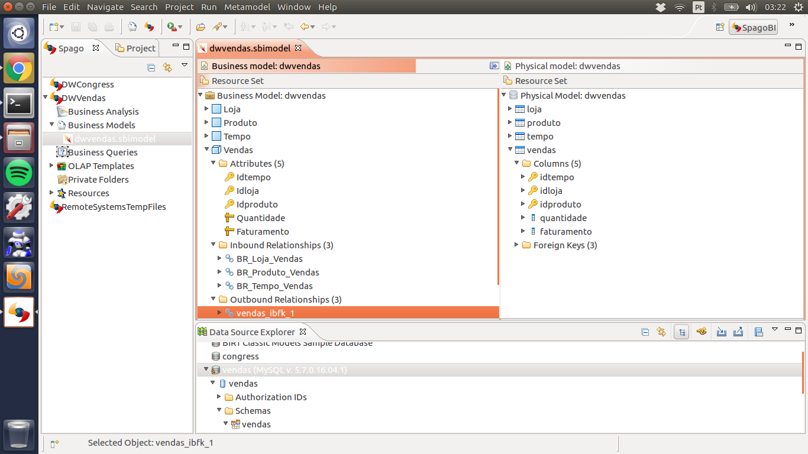
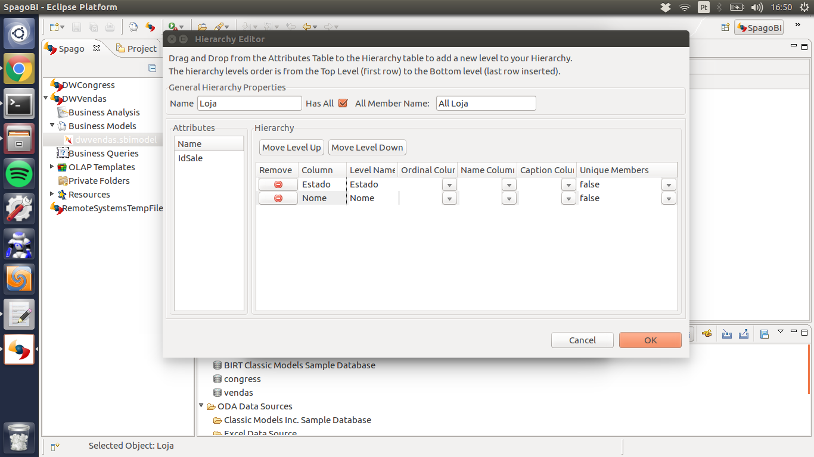
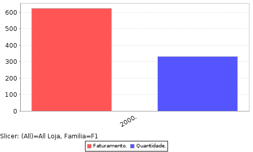

Title: Aplicação OLAP - DW de vendas com SpagoBI
Date: 2017-11-06 07:35
Category: DataWarehouse
Tags: olap, starSchema, spagobi
Slug: spagobi
Author: Elizabete Reis
Summary: DW de vendas com SpagoBI

#Aplicação OLAP - DW de vendas com SpagoBI

----------
A criação do data warehouse demanda inicialmente a criação de um  star schema composto por uma tabela fato e as várias dimensões que a rodeiam. A figura 1 representa o modelo star schema para a aplicação de vendas. O script para criação do banco pode ser encontrado em .

A partir do star schema apresentado anteriormente foi criado o modelo (figura 2) através do SpagoBi Studio, cuja tabela *Vendas* representa o fato ocorrido, os atributos que podem ser medidos são *Quantidade* e *Faturamento*  que tem como características as dimensões *Loja*, *Produto* e *Tempo*.

Após definir os atributos meansuráveis, foram definidas as hierarquias para os atributos de cada tabela no modelo, exceto as chaves primárias. Na figura 3 é possível visualizar a hierarquia da tabela Loja, já em *Produto* produto a hierarquia ficou primeiramente família, depois categoria e por último nome e finalmente para *Tempo* primeiro ano, mês e dia.

Finalizado o business model, o cubo será criado e enviado ao server. Através da interface do server no browser é possível gerar gráficos com os indicadores escolhidos para o negócio. O indicador escolhido (figura 4) para o exemplo de vendas foi o faturamento e a quantidade vendidas de produtos classificados como família F1 para o ano 2000.

Mais detalhes sobre esta atividade podem ser encontradas no tutorial que seguimos em [tutorial spagobi.](https://www.youtube.com/watch?v=0wdOwN7OUDo&list=PLLpHJYAJTb87pMTMCkOrsa8mSvoXA_Wqw). O código da aplicação encontra-se disponível em (https://github.com/tebduneb/VendasSpagobi).
