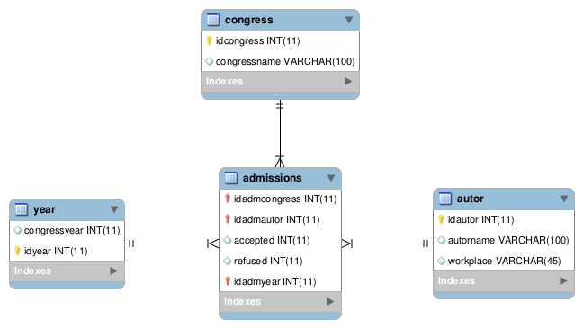

Title: Aplicação OLAP - Star Schema e DW de Congresso
Date: 2017-10-23 07:30
Category: olap
Tags: android, olap, starschema
Slug: projeto-dw
Author: Elizabete Reis
Summary: Aplicação OLAP

**Aplicação OLAP - Star Schema e DW de Congresso**

----------
A criação do data warehouse demanda inicialmente a criação de um modelo de dados dimensionais  da aplicação chamado *star schema*. Tal modelo é composto por uma tabela central ou tabela fato e várias dimensões. A tabela fato armazena o fato ocorrido, os atributos mensuráveis e as chaves para as dimensões, já as dimensões são as tabelas contém as características do fato que ocorreu. A figura 1 representa o modelo star schema para a aplicação de submissão artigos.

No modelo apresentado na figura as dimensões são as tabelas *congress* e *autor*, um fato é representado pela tabela *admissions* que contém *accepted* e *refused*, os atributos mensuráveis do modelo que representam respectivamente os artigos aceitos e os recusados por um determinado congresso. 

O indicador escolhido para ser mensurado foi o número de artigos publicados por autor, lembrando que para um artigo ser publicado ele precisa ser aceito. Para chegar até esse indicador algumas questão foram colocadas:

 1.  Qual fato ocorreu? Um artigo x foi aprovado
 2. Quando este fato ocorreu? No ano y
 3. Quem? Pelo autor z
 
Estas respostas foram a base para criação do cubo através da ferramenta [SpagoBI](spagobi.org) , o projeto em questão utilizou a versão 5.2 do servidor e 4.2 da ide SpagoBI Studio, pois a versão mais recente da IDE apresentou problemas no ambiente linux. A figura 2 mostra a criação do modelo do cubo através da ferramenta citada.

Após a criação o cubo foi enviado ao server onde é possível gerar relatórios em forma de gráficos ou tabelas cruzando as informações das tabelas de dimensão e fato. A figura 3 apresenta uma tabela com uma relação entre autor e quantidade artigos aceitos e recusados.

Na primeira e segunda coluna estão os valores relativos a artigos aceitos e recusados, respectivamente, e na terceira o nome do autor destes artigos.

A próxima etapa do projeto e realizar o processo de ETL para migrar as informações do base relacional para a base do DW.
